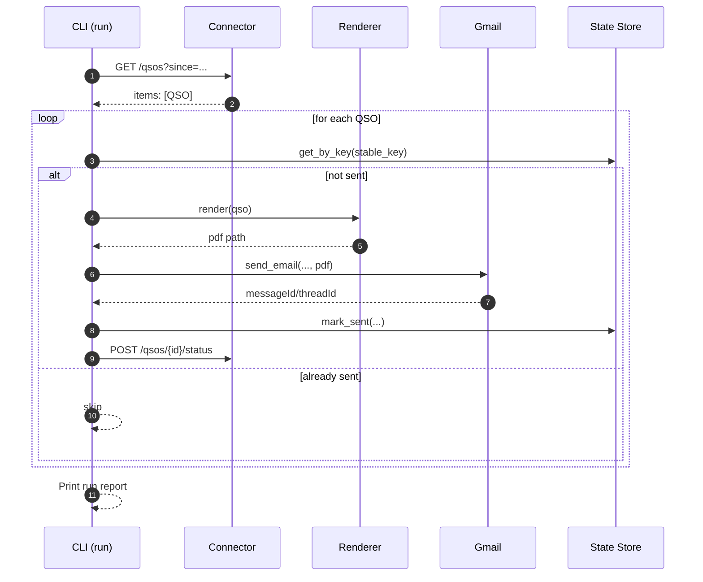

```mermaid
sequenceDiagram
  autonumber
  participant CLI as CLI (run)
  participant Conn as Connector
  participant Rend as Renderer
  participant Mail as Gmail
  participant State as State Store

  CLI->>Conn: GET /qsos?since=...
  Conn-->>CLI: items: [QSO]
  loop for each QSO
    CLI->>State: get_by_key(stable_key)
    alt not sent
      CLI->>Rend: render(qso)
      Rend-->>CLI: pdf path
      CLI->>Mail: send_email(..., pdf)
      Mail-->>CLI: messageId/threadId
      CLI->>State: mark_sent(...)
      CLI->>Conn: POST /qsos/{id}/status
    else already sent
      CLI-->>CLI: skip
    end
  end
  CLI-->>CLI: Print run report
```
